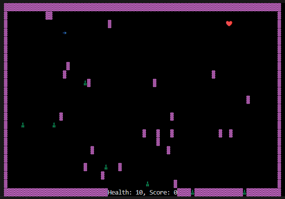

# About
This is a hide-n-seek game created with Rust. It was originally a sample project for me to learn Rust. However, it turned out a fun game to play. I hope you enjoy it.

# How to run the game
You have to have cargo and rust installed in your system. Then, you can run the game using the `cargo run` command.

# How to play
The snapshot of the game is shown below. The game has four entities:
- Player: This is a blue arrow shown in the game. You can control the movement of this entity.
- Enemies: these are the green entities in the game. They follow you and if you collide with them, you lose health.
- Walls: These are shown with color pink. You are surrounded with them and you can pass them.
- Heart: These are shown with the heart icon in the game. If you collide with them, your score increases.

Moreover, the objective of the game is to collect as much score as you can before you lose all your health. When you reach a heart, your score increases, the heart vanishes, and another random heart is created in the game.

## Player Movement

You can control the direction of the player using the right and left arrow keyboard buttons. when pressing the right arrow, the direction rotates 45 degrees clockwise. Pressing the left arrow does it in reverse.

Moreover, the speed of the player does not change.